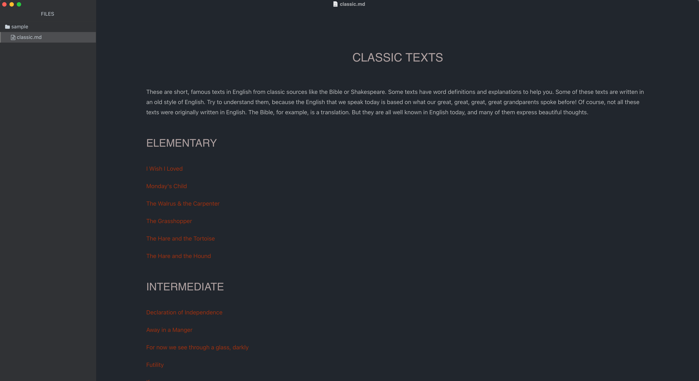
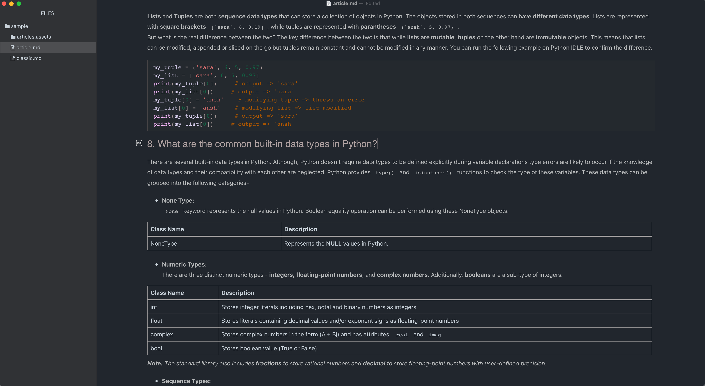

# Knight Themes for Typora

Dark and Wide

## Installation

1. Download the zipped project package or the [latest stable release](https://github.com/Fiery-Maple/knight/releases/latest).
2. Launch Typora and open `Preferences` from the app menu.
3. Go to the `Appearance` tab, and choose `Open Theme Folder`.
4. Copy all the `knight.css` files and the `knight` folder to your Typora theme library.
5. Launch or restart Typora and choose one of the `Knight` themes from the theme menu.

## Screenshots

All the screenshots below feature the Knight.

### Articles

## Credits

- Created by [Jonny Zhang](https://github.com/dewmaple).
